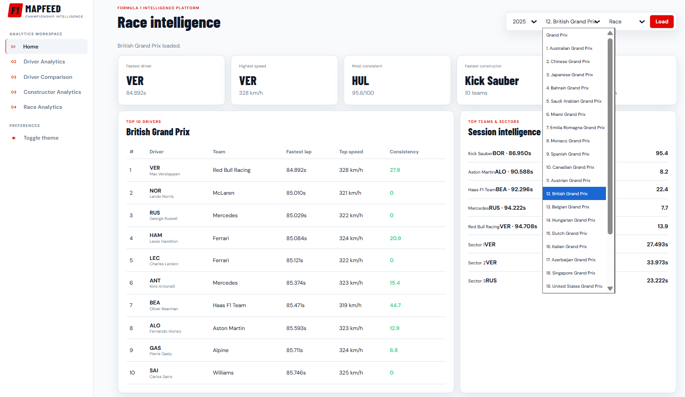
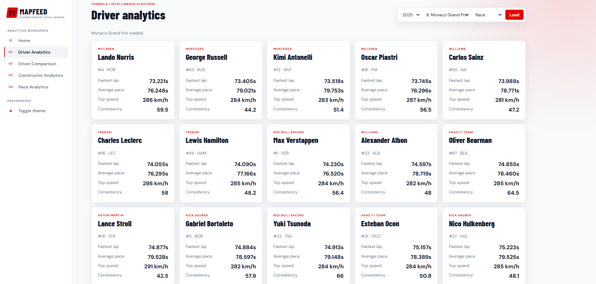
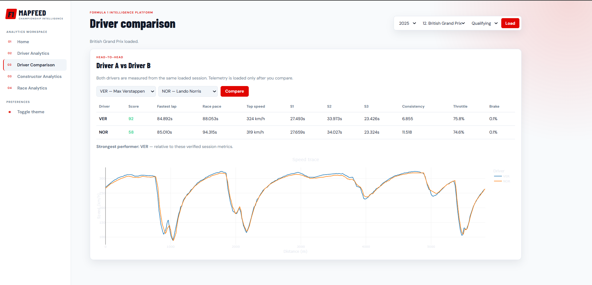
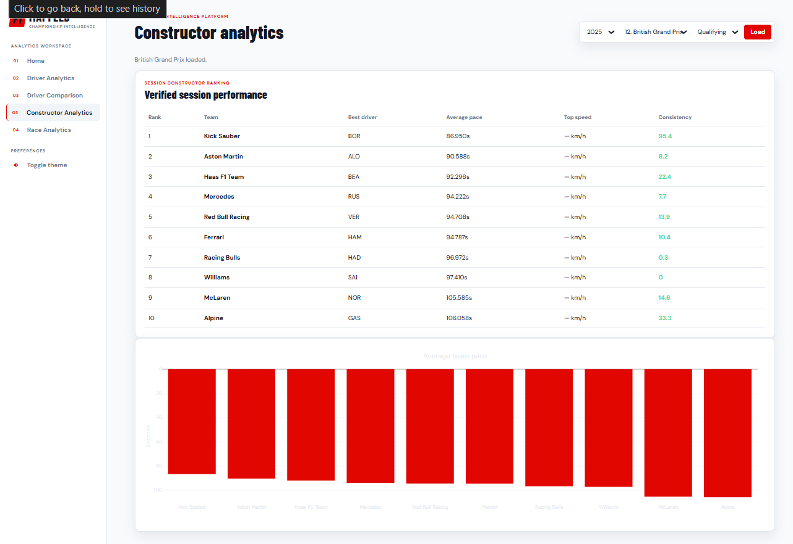
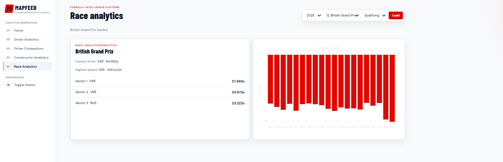
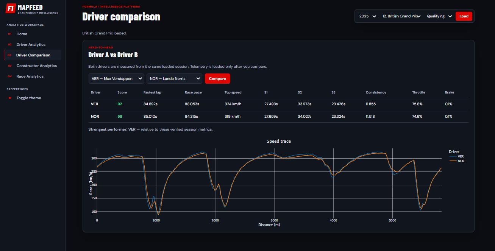

# F1 MAPFEED

F1 MAPFEED is a web-based Formula 1 analytics platform built using **Python**, **Flask**, and **FastF1**. It provides interactive dashboards for exploring Formula 1 telemetry, comparing drivers, analyzing constructor performance, and visualizing race statistics through real-world telemetry data.

The project focuses on transforming raw telemetry into meaningful insights using interactive visualizations and performance analytics.

---

## Features

* Interactive Formula 1 analytics dashboard
* Driver performance analysis
* Driver comparison
* Constructor analytics
* Race analytics
* Telemetry visualization
* Session insights and statistics
* Performance metrics and leaderboards
* Responsive interface
* Light and Dark theme support

---

## Tech Stack

### Backend

* Python
* Flask
* FastF1

### Data Processing

* Pandas
* NumPy

### Data Visualization

* Plotly
* Matplotlib

### Frontend

* HTML
* CSS
* JavaScript


---

## Application Preview

---
# Application Preview
---
## Dashboard

The dashboard provides an overview of the selected Formula 1 session, including key performance indicators, driver rankings, constructor standings, and session insights.



---

## Driver Analytics

Analyze individual driver performance with detailed telemetry metrics, fastest lap information, average pace, top speed, consistency score, and sector times.



---

## Driver Comparison

Compare two drivers using telemetry data, including speed traces, lap times, pace analysis, sector comparison, and overall performance metrics.



---

## Constructor Analytics

Evaluate constructor performance through team rankings, average pace, consistency analysis, and best-performing drivers.



---

## Race Analytics

View race-level insights, including fastest drivers, top speeds, sector leaders, and overall session statistics.



---

## Dark Theme

The dashboard supports both Light and Dark themes for an improved viewing experience.



---

## Project Structure

```text
F1-MAPFEED
│
├── screenshots/
│   ├── dashboard-home.png
│   ├── driver-analytics.png
│   ├── driver-comparison-light.png
│   ├── driver-comparison-dark.png
│   ├── constructor-analytics.png
│   └── race-analytics.png
│
├── src/
│   ├── analytics.py
│   ├── championship_service.py
│   ├── comparison.py
│   ├── constructor_service.py
│   ├── dashboard.py
│   ├── prediction_service.py
│   ├── session_analytics.py
│   ├── session_loader.py
│   ├── telemetry.py
│   ├── trackmap.py
│   └── plotter.py
│
├── static/
│   ├── css/
│   └── js/
│
├── templates/
│
├── requirements.txt
├── README.md
├── LICENSE
└── .gitignore

```
---
## Installation

Clone the repository.

```bash
git clone https://github.com/Suchendra-018/F1-MapFeed.git
cd F1-MapFeed
```

Create a virtual environment.

```bash
python -m venv venv
```

Activate the virtual environment.

**Windows**

```bash
venv\Scripts\activate
```

Install the required dependencies.

```bash
pip install -r requirements.txt
```

---

## Running the Application

Start the Flask application.

```bash
python src/dashboard.py
```

Open your browser and visit:

```text
http://127.0.0.1:5000
```

---

## Supported Data

Current support includes:

* Formula 1 2024 Season
* Formula 1 2025 Season
* Race Sessions
* Qualifying Sessions

---

## Current Status

* Interactive dashboard
* Driver analytics
* Driver comparison
* Constructor analytics
* Race analytics
* Session intelligence
* Light and Dark theme
* Responsive interface

---

## Work in Progress

Most Race and Qualifying sessions are supported. However, telemetry for some Grand Prix sessions may not load correctly due to incomplete or unavailable data provided by the FastF1 source.

Future updates will improve session compatibility, telemetry reliability, and support for additional seasons.

---

## Future Enhancements

* Free Practice (FP1, FP2, FP3)
* Sprint Sessions
* Championship Standings
* Tyre Strategy Analysis
* Weather Analysis
* Pit Stop Analysis
* AI-based Race Predictions
* Historical Season Support
* Export Reports (PDF/CSV)
* Live Telemetry Dashboard

---

## License

This project is licensed under the MIT License. See the **LICENSE** file for more information.

---

## Author

**Suchendra A**

Information Science Engineering Student

Interested in Software Development, Artificial Intelligence, Data Analytics, and Formula 1 Technology.
